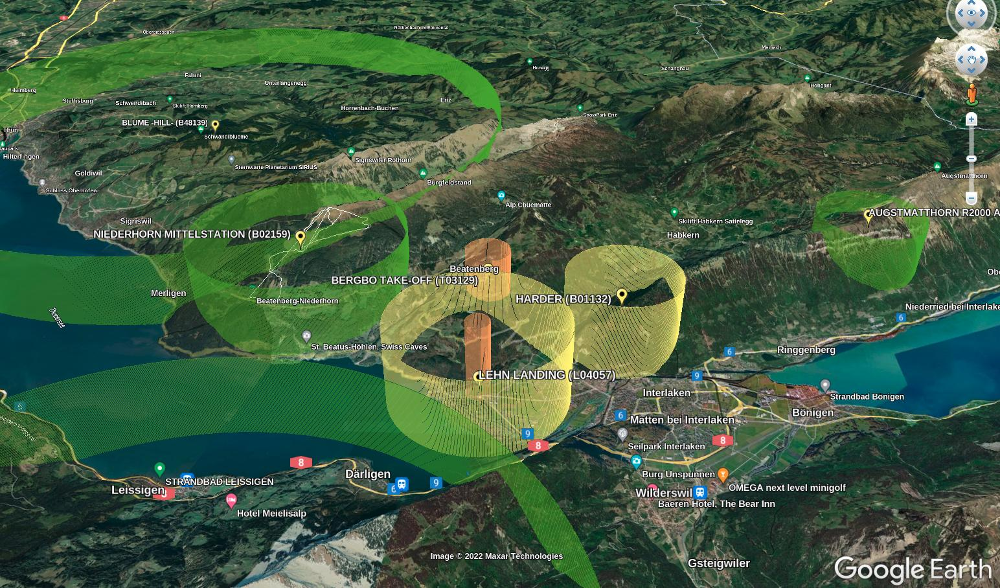

# XCTask to KML converter
This code converts .xctask files into cylinders for google earth.



## Installation
Install the package and executables:
```pip install .```

## Usage
```xctsk2kml <taskfile.xctsk> <output.kml>```

## Disclaimer
The parametrization is done using CH1903 as coordinate system. Thus the
tasks can only be placed at meaningfull locations within Switzerland
and the position might deviate up to a few meters.

## Open Issues
* Goal line perpendicular to center of latest Waypoint?
* No optimized route
* Only supported within CH1903
